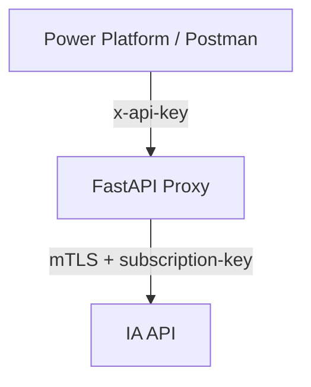

# eLicense API Proxy

## 1. Introductie

Deze repository bevat een complete FastAPI proxy voor lokale ontwikkeling. De proxy staat tussen Power Platform of Postman en de externe IA API.

Belangrijkste eigenschappen:

- Inbound beveiliging met API key
- Outbound mTLS met PFX certificaat + wachtwoord
- Automatisch toevoegen van `subscription-key` aan backend requests
- Transparant doorzetten van payloads en responses
- Structured logging met request-id
- Ontwerp dat eenvoudig migreerbaar is naar Azure Functions

## 2. Architectuurdiagram



## 3. Installatie

Vereist:

- Python 3.12
- Toegang tot een PFX clientcertificaat

Clone de repository en ga naar de root van het project.

## 4. Virtual environment aanmaken

```bash
python3.12 -m venv .venv
source .venv/bin/activate
```

## 5. Dependencies installeren

```bash
pip install --upgrade pip
pip install -r requirements.txt
```

## 6. Applicatie starten

```bash
uvicorn app:app --reload
```

De app start standaard op `http://127.0.0.1:8000`.

## 7. Voorbeeld `.env`

Maak een `.env` bestand op basis van `.env.example`:

```env
BASE_URL_IA=https://test.partner.example
SUBSCRIPTION_KEY=xxxxxxxxxxxxxxxxxxxx
PFX_CERTIFICATE_PATH=certs/client.pfx
PFX_CERTIFICATE_PASSWORD=secret
REQUEST_TIMEOUT=30
INBOUND_API_KEY_NAME=x-api-key
INBOUND_API_KEY=xxxxxxxxxxxxxxxxxxxxxxxxxxxxxxxx
```

## 8. Certificaat plaatsen

Plaats je PFX bestand op het pad dat is ingesteld in `PFX_CERTIFICATE_PATH`, bijvoorbeeld:

- `certs/client.pfx`

De proxy zet het PFX bestand automatisch om naar tijdelijke PEM bestanden voor `httpx` en verwijdert deze daarna.

## 9. Testen met Postman

Gebruik op alle endpoints behalve `/health` de API key header:

- Headernaam: waarde uit `INBOUND_API_KEY_NAME` (standaard `x-api-key`)
- Headervalue: waarde uit `INBOUND_API_KEY`

### GET `/health`

```http
GET http://127.0.0.1:8000/health
```

### POST `/documents`

```http
POST http://127.0.0.1:8000/documents
x-api-key: <jouw key>
Content-Type: application/json
```

Bodyvoorbeeld: zie [examples/create_document.json](examples/create_document.json).

### POST `/documents/activation-status`

```http
POST http://127.0.0.1:8000/documents/activation-status
x-api-key: <jouw key>
Content-Type: application/json
```

Bodyvoorbeeld: zie [examples/activation_status.json](examples/activation_status.json).

### DELETE `/documents`

```http
DELETE "http://127.0.0.1:8000/documents?docType=org.iso.23220.1.nl.kiwa.sampcert&document_number=Kiwa_260303_1"
x-api-key: <jouw key>
```

Queryvoorbeeld: zie [examples/delete_document.json](examples/delete_document.json).

Sneller testen met meegeleverde collectie:

- Importeer [examples/postman_collection.json](examples/postman_collection.json)
- Stel variabelen in: `baseUrl`, `apiKeyHeader`, `apiKey`

Sneller testen via curl:

```bash
./examples/curl_tests.sh
```

Optioneel met overrides:

```bash
BASE_URL=http://127.0.0.1:8000 \
API_KEY_HEADER_NAME=x-api-key \
API_KEY_VALUE=your-local-key \
./examples/curl_tests.sh
```

## 10. Swagger gebruiken

Open Swagger UI op:

- `http://127.0.0.1:8000/docs`

In Swagger:

1. Klik op `Authorize`.
2. Vul de inbound API key in.
3. Voer requests uit op de beveiligde endpoints.

De security configuratie toont API-key authenticatie direct in de OpenAPI documentatie.

## 11. Logging

Structured logs worden geschreven naar:

- stdout
- `logs/proxy.log`

Per request worden o.a. gelogd:

- `request_id`
- HTTP methode
- inkomend endpoint
- backend endpoint (met gemaskeerde subscription-key)
- backend statuscode
- backend duur (ms)
- totale duur (ms)

Nooit gelogd:

- API keys
- subscription keys
- certificaatwachtwoord
- certificaatinhoud

## 12. Troubleshooting

Veelvoorkomende problemen:

- `missing_configuration`:
	- Controleer of alle verplichte variabelen in `.env` staan.
- `certificate_not_found` of `invalid_certificate_path`:
	- Controleer `PFX_CERTIFICATE_PATH` en of het bestand bestaat.
- `invalid_certificate_password`:
	- Controleer `PFX_CERTIFICATE_PASSWORD`.
- `backend_timeout`:
	- Verhoog `REQUEST_TIMEOUT` of controleer backend beschikbaarheid.
- `backend_connect_error`:
	- Controleer DNS, netwerk, firewall en backend URL.

Auth gedrag:

- Geen API key header: `401 Unauthorized`
- Verkeerde API key: `403 Forbidden`

## 13. Migratiepad naar Azure Functions

Deze implementatie is voorbereid op migratie naar Azure Functions:

- Routehandlers zijn dun en bevatten alleen proxylogica.
- Configuratie is centraal en omgeving-gedreven.
- Outbound clientgedrag is geïsoleerd in helperfuncties.
- Logging is gestructureerd en eenvoudig over te nemen.

Praktische migratiestappen:

1. Verplaats endpointlogica naar Function triggers (HTTP trigger per route).
2. Hergebruik config-loading en mTLS helperlaag.
3. Vervang FastAPI dependency-auth door Functions middleware/guard.
4. Behoud request-id logging en foutmodel.
5. Zet secrets in Azure Key Vault + App Settings.